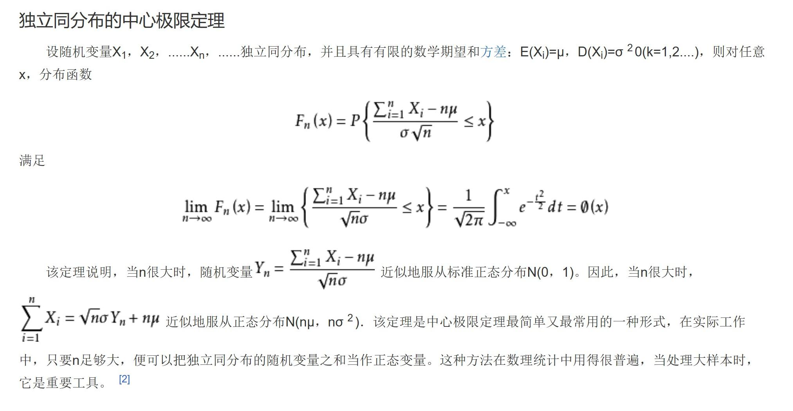

# 统计

## 定义
- 统计学是一门关于如何通过**随机样本**数据估计随机变量总体分布或分布特征的学科

## 与数学的关系
- 数学是研究变量的，而统计学是研究随机变量，两者区别就在此。

## 随机变量
- 随机变量是变量值是由随机抽样调查方式得到的变量。
- 随机是特定情势里最不确定者，
- 最不确定是指没有任何先验信息可利用或者有也不用

## 随机例子
- 洗牌，翻牌

## 正态分布
- 统计应用的广泛性来源于数据存在的广泛性，而这又来源于信息无处不在
- 统计学的精髓
- 统计学的核心定理为中心极限定理
	- 任意总体，样本量足够大，通过随机抽样得到的样本均值服从正态分布
- 规律是变化中不变的东西
- 所有的正态分布都可以进行标准化变换 
	- 任一变量值减去所有变量值的均值的差然后除以所有变量值的标准差
- 变量可以看成是其所有变量值的集合
- 一个变量服从正态分布，其进行标准化后服从标准正态分布

- 联合分布的分布特征是均值向量和协方差阵
- 线性：向量的加法和数乘
- 两个分类型变量的联合分布常用列联表表示，其分布特征是众数和异众比率
- 分布：所有可能取到的变量值及其对应概率值和频率的一揽子展示

- 中心极限定理：只有两个有用，一个是数值变量，另一个是分类变量

# 多元统计
## 定义
- 研究多个随机变量的统计学
- 侧重于因果关系分析，要包括多个因变量或者多个自变量，
- 例子：
	- 企业101表，个人简历，签证申请，机构五证合一，网上订票

## 变量分类
- 变量：常变量，二值变量，多值变量
- 依据变量值的多少分：离散和连续
- 依据容许的运算分：可列，可数，可加，可积
- 依据统计分析的逻辑分：分类，顺序，数值

- 顺序变量在大多数场合最终被化掉了，不过在非参有大用
- 分类：= 可数，概率
- 顺序：> 可排，百分数是顺序变量
- 数值：+ 可加，期望

## 大数定律
- 频率估计概率的理论基础
- 格里文科定理的先声与基因

## 作业
- 中心极限定理有哪两个重要
- 数值随机变量

- 分类随机变量

- 分类变量与数值变量的特点

分类数据之间没有数量上的关系和差异，反映事物类别。如，用1表示“男性”，0表示“女性”，但是1和0等只是数据的代码。
数值数据之间有数量上的关系和差异，能够进行数学运算。

